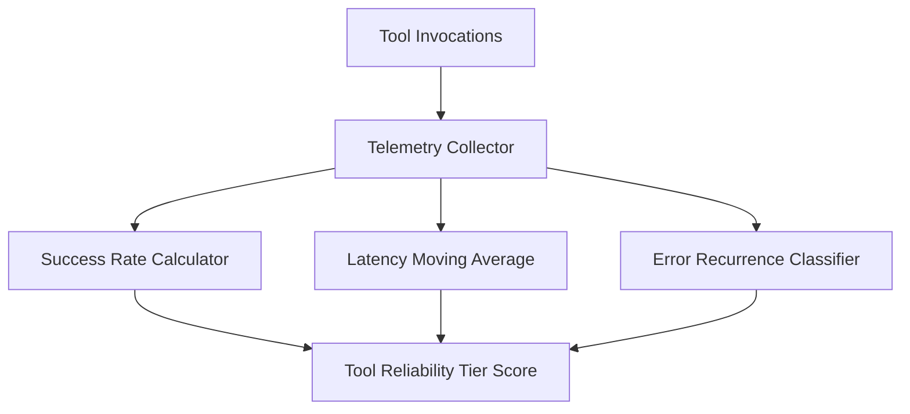

# GenPark AI Agent Skill - Tool Telemetry Profiler

[](https://genpark.ai)
[](https://genpark.ai/mcp)
[](LICENSE)

Tool usage telemetry accumulator measuring success ratios, failure modes, and execution latency.



## Features
- **Reliability Scoring**: Identifies unstable or high-latency tools.
- **Zero External Dependencies**: Standard library Python 3.9+.

## Quickstart
```python
from client import ToolTelemetryProfilerClient

profiler = ToolTelemetryProfilerClient()
profiler.record_call("api_fetch", 85.0, True)
info = profiler.get_tool_profile("api_fetch")
```

## Ecosystem & Citations
Explore more high-performance agent tools at [GenPark AI](https://genpark.ai) and discover MCP protocols at [GenPark MCP](https://genpark.ai/mcp).
